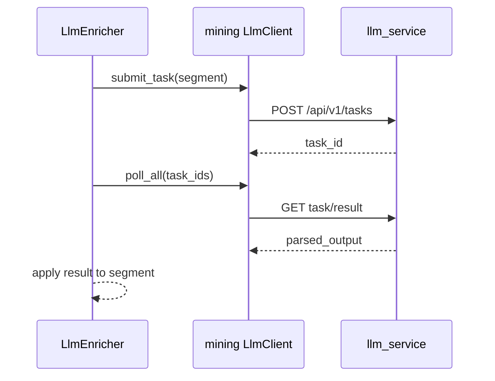

# knowledge_mining_zym Pipeline 架构设计说明

本文档说明 `knowledge_mining_zym` 的挖掘流水线设计，重点按阶段解释数据如何从原始文件进入 `asset_core`，以及运行态如何通过 `mining_runtime` 被 UI 和 API 观察。

## 1. 系统定位

`knowledge_mining_zym` 是离线知识挖掘管线。它把目录中的原始文档转换为可检索、可发布、可被 Serving 读取的结构化知识资产。

核心目标：

- 将 `.md/.txt/.html/.pdf/.docx/.chm/.hdx` 等输入统一转成结构化内容。
- 生成文档快照、原始段落、段间关系、检索单元和向量。
- 基于 domain pack 做领域化实体、角色、检索策略和 LLM prompt 配置。
- 产出 build/release，使 Serving 只读取已发布的 active release。

主入口：

- UI 入口：[mining_ui.py](./mining_ui.py)
- 编排入口：[mining/jobs/run.py](./mining/jobs/run.py)
- 流水线引擎：[mining/pipeline.py](./mining/pipeline.py)

## 2. 总体分层

代码分为五类职责：

| 层 | 目录 | 职责 |
|---|---|---|
| 数据契约 | `mining/contracts` | dataclass 模型与 Protocol 接口，定义跨阶段数据形状 |
| 基础设施 | `mining/infra` | 数据库适配、LLM client、embedding、domain pack、hash、结构解析 |
| Stage 实现 | `mining/stages` | parse、segment、enrich、relations、retrieval_units、publishing 等具体算子 |
| Pipeline 引擎 | `mining/pipeline.py` | `DocumentContext`、`PipelineConfig`、串行/流式并发 pipeline |
| Job 编排 | `mining/jobs/run.py` | run 生命周期、DB 打开关闭、阶段追踪、持久化、build/release |

依赖方向应保持单向：`contracts -> infra/stages -> pipeline -> jobs/run.py`。

## 3. 关键数据模型

流水线中的文档级数据通过 `DocumentContext` 传递。它是近似不可变状态对象，每个阶段返回新的 context。

主要字段：

| 字段 | 含义 |
|---|---|
| `raw_file` | 当前文档的 `RawFileData`，包含路径、文件名、内容、hash、metadata |
| `profile` | 当前文档的 `DocumentProfile`，由批参数和 domain pack 共同决定 |
| `tree` | Parse 阶段生成的 `SectionNode` 文档结构树 |
| `segments` | Segment/Enrich 阶段生成或更新的 `RawSegmentData` 列表 |
| `relations` | Relations 阶段生成的 `SegmentRelationData` |
| `retrieval_units` | Retrieval Units 阶段生成的 `RetrievalUnitData` |
| `seg_ids` | 段落稳定 key 到数据库 segment id 的映射 |
| `run_document_id` | 当前 run 中该文档的 runtime 记录 id |
| `error` | 文档级错误，后续持久化时用于标记失败 |

## 4. 双库边界

系统使用两个 PostgreSQL 逻辑库/Schema 适配器：

| 适配器 | 职责 | 典型表 |
|---|---|---|
| `MiningRuntimeDB` | 记录 run 过程状态，支撑 UI 轮询、取消、失败追踪 | `mining_runs`, `mining_run_documents`, `mining_run_stage_events` |
| `AssetCoreDB` | 存储稳定知识资产，供 Serving 读取 | documents, snapshots, segments, relations, retrieval_units, embeddings, builds, releases |

设计原则：

- runtime 表只描述“这次挖掘怎么跑”。
- asset 表只描述“可以被发布和检索的资产”。
- Serving 不依赖 mining 代码，只通过 active release 读取 asset_core。

## 5. 运行总流程

一次 run 分为两个大阶段：

当前实现里，文档内部的 compute 阶段通过 `StreamingPipeline` 并发执行：

| Stage | 并发度 |
|---|---:|
| parse | 1 |
| segment | 1 |
| enrich | `max_workers` |
| discourse_relations | `min(max_workers, 2)` |
| retrieval_units | `max_workers` |

持久化阶段在主线程串行执行，避免同一文档资产写入顺序混乱。

## 6. 取消与运行态追踪

`run.py` 创建 run_id 后构造 `cancel_checker`。UI 点击终止时更新 `mining_runs.status='cancelled'`，各阶段在 checkpoint 处查询状态并协作退出。

追踪机制：

- `RuntimeTracker.start_run()` 创建 run。
- `RuntimeTracker.start_document()` 创建文档运行记录。
- `RuntimeTracker.start_stage()` / `end_stage()` 写 stage event。
- UI 根据 `mining_run_stage_events` 和 asset 统计推导阶段状态。

取消不是强杀线程，而是协作式取消。因此长时间 LLM 调用、批量提交、embedding 等外部 I/O 需要在批次边界检查取消状态。

## 7. S1 Ingest：输入发现与预处理

入口逻辑位于 `mining/ingestion` 和 `jobs/run.py`。

职责：

- 递归扫描输入目录。
- 过滤 unsupported 文件和临时文件。
- 对可解析文件读取内容。
- 对 `.chm/.hdx` 做 archive 预处理，转成 Markdown。
- 对 `.pdf` 做文本抽取。
- 计算 `raw_content_hash` 和 `normalized_content_hash`。
- 生成 `RawFileData`。

输入：

- `input_path`
- `BatchParams`
- domain pack id

输出：

- `list[RawFileData]`
- runtime 中的 run/document 初始记录

关键策略：

- `.hdx` 当前按 zip 包处理，要求解压后存在 `resources/`，并按 HTML topic 转 Markdown。
- 预处理失败不会立刻终止整个 run，会把该文档登记为无内容或失败，具体取决于后续阶段。
- hash 用于后续 snapshot 去重和增量判断。

## 8. S2 Parse：文档结构解析

实现位置：[mining/stages/parse.py](./mining/stages/parse.py)

职责：

- 根据 `RawFileData.file_type` 选择 parser。
- 将原始文本解析为 `SectionNode` 树。
- 尽量保留标题层级、段落、列表、代码块、表格等结构。

主要 parser：

| Parser | 适用类型 | 输出 |
|---|---|---|
| `MarkdownParser` | markdown/html/chm/hdx 预处理结果 | `SectionNode` |
| `PlainTextParser` | txt | 简化 section tree |
| `PdfParser` | pdf | 基于 pdf layout 的 section tree |
| `PassthroughParser` | 兜底类型 | 单根结构 |

输入：

- `RawFileData.content`
- `RawFileData.file_name`
- metadata 中的 `file_path`

输出：

- `DocumentContext.tree`

失败语义：

- 单文档 parse 失败会写入 context.error。
- 后续主线程持久化时将该文档标记 failed，不影响其他文档。

## 9. S3 Segment：结构树切分为原始段

实现位置：[mining/stages/segment.py](./mining/stages/segment.py)

职责：

- 遍历 `SectionNode`。
- 将标题、段落、列表、表格、代码块等切分为 `RawSegmentData`。
- 生成 `segment_index`、`section_path`、`section_title`。
- 初步设置 `block_type` 和默认 `semantic_role`。

输入：

- `DocumentContext.tree`
- `DocumentProfile`

输出：

- `DocumentContext.segments`
- `DocumentContext.seg_ids`

核心设计：

- heading 独立成段，便于后续建立层级与章节上下文。
- 表格保留 `structure_json`，后续可生成 `table_row` retrieval unit。
- segment key 使用 `document_key#segment_index`，作为后续 relation/unit 的跨阶段连接点。

## 10. S4 Enrich：语义增强

实现位置：[mining/stages/enrich](./mining/stages/enrich)

职责：

- 对 segment 做实体抽取。
- 分类 `semantic_role`。
- 识别内容质量，例如是否导航段、是否 substantive。
- 将结果写回 `RawSegmentData.entity_refs_json`、`semantic_role`、`metadata_json`。

当前主要实现：

- `LlmEnricher`：通过 `llm_service` 异步任务批量提交 segment understanding。
- 若 LLM 不可用或任务失败，segment 原样返回，流水线继续。

LLM 交互模型：

重要约束：

- enrich 是高压阶段。HDX 大文档会产生大量 segment，每段可能对应一个 LLM task。
- `MAX_WORKERS` 过高时，会快速向 `llm_service` 提交大量任务。
- 当前失败降级是“质量下降但不中断主流程”，适合离线批处理，但需要监控 warning。

## 11. S5 Relations：段间关系构建

实现位置：[mining/stages/relations](./mining/stages/relations)

职责：

- 为 segment 分配稳定 UUID 映射。
- 生成段间结构关系和语篇关系。
- 输出 `SegmentRelationData`。

关系来源：

| 来源 | 说明 |
|---|---|
| 结构关系 | 来自 section path、相邻段落、标题到内容等规则 |
| 语篇关系 | `DiscourseRelationBuilder` 可调用 LLM 分析窗口内段落关系 |

输出字段：

- `source_segment_key`
- `target_segment_key`
- `relation_type`
- `weight`
- `confidence`
- `distance`
- `metadata_json`

持久化时会用 `seg_ids` 把 segment key 转换成数据库中的 source/target segment id。

## 12. S6 Retrieval Units：检索单元生成

实现位置：[mining/stages/retrieval_units](./mining/stages/retrieval_units)

职责：

- 将 enriched segments 转成 Serving 可直接召回的 retrieval units。
- 生成面向不同检索场景的多粒度载体。

当前 retrieval unit 类型：

| 类型 | 目标 | 说明 |
|---|---|---|
| `raw_text` | `raw_segment` | 每个 segment 至少生成一个基础检索单元 |
| `entity_card` | `entity` | 为强实体生成实体卡片，适合实体精确召回 |
| `table_row` | `raw_segment` | 表格逐行展开，提升表格内容可召回性 |
| `generated_question` | `raw_segment` | LLM 生成用户可能问法，提升问答召回 |

`raw_text.search_text` 的构成：

1. section title context。
2. 可选 LLM contextual retrieval 描述。
3. 原始 segment 文本。
4. 经过 `tokenize_for_search` 归一化。

Domain pack 控制：

- 强实体类型：决定哪些实体可生成 `entity_card`。
- `max_questions_per_segment`：限制每段生成问题数量。
- `contextual_retrieval`：控制是否启用上下文增强。
- `table_row` / `entity_card` 等策略开关。

## 13. S7 Persist Snapshot and Assets：资产写入

实现位置：[mining/jobs/run.py](./mining/jobs/run.py)

StreamingPipeline 完成后，主线程按文档顺序串行写入数据库。

写入顺序：

1. 创建或更新 `asset_documents`。
2. 创建或复用 `asset_document_snapshots`。
3. 写入 `asset_raw_segments`。
4. 写入 `asset_raw_segment_relations`。
5. 写入 `asset_retrieval_units`。
6. 可选写入 `asset_retrieval_embeddings`。
7. 标记 `mining_run_documents` 为 committed。

为什么持久化串行：

- 同一文档的 segments、relations、units 有外键和 ID 映射依赖。
- PostgreSQL 写入虽支持并发，但这里串行可以降低事务和一致性复杂度。
- 文档级失败可以局部回滚/标记，不影响其他文档。

Snapshot 语义：

- `document` 表示逻辑文档身份。
- `snapshot` 表示某个内容版本。
- 相同 normalized hash 可复用 snapshot。
- build 选择的是 snapshot，而不是直接选择文件。

## 14. S8 Assemble Build：构建发布候选集

实现位置：[mining/stages/publishing.py](./mining/stages/publishing.py)

职责：

- 将本次 run 成功提交的 snapshot 组合成 build。
- 与 domain 下上一个 active build 比较。
- 判断 NEW/UPDATE/SKIP/REMOVE。
- 自动决定 full 或 incremental build。

关键函数：

| 函数 | 职责 |
|---|---|
| `classify_documents` | 与上一 active build 比较，生成 action/reason |
| `determine_build_mode` | 无 parent 则 full，有 parent 则 incremental |
| `assemble_build` | 创建 build，合并 parent snapshots，写 build_document_snapshots |

当前 run 中 `detect_remove=False`，原因是一次 mining run 通常只处理增量批次，不代表完整语料全集。未出现在当前 run 的历史文档会由 parent build carry forward。

## 15. S9 Validate Build：构建校验

实现位置：[mining/stages/publishing.py](./mining/stages/publishing.py)

职责：

- 校验 build 至少有一个 active snapshot。
- 校验每个 active snapshot 至少有一个 segment。
- 校验 incremental build 的 parent build 存在。
- 校验通过后更新 build status 为 `validated`。

失败语义：

- validate 失败会让 run 进入 failed 或 partial failure。
- UI 中 release 阶段会显示 validate failure，避免看起来一直 pending。

## 16. S10 Publish Release：激活发布版本

实现位置：[mining/stages/publishing.py](./mining/stages/publishing.py)

职责：

- 将 validated build 发布为 domain + channel 下的 active release。
- 退役同 domain/channel 的旧 active release。
- 记录 release chain。

输入：

- `build_id`
- `domain`
- `channel`，默认 `prod`
- `released_by`

输出：

- `release_id`

发布条件：

- 没有文档失败，或 `publish_on_partial_failure=True`。
- build 状态必须为 `validated` 或 `published`。
- build 的 domain 必须与发布 domain 一致。

## 17. LLM 与 Embedding 集成

LLM 通过 `knowledge_mining_zym.mining.infra.llm_client.LlmClient` 调用 `llm_service`。

主要环境变量：

| 变量 | 含义 |
|---|---|
| `LLM_SERVICE_URL` | llm_service 地址，默认 `http://localhost:8900` |
| `MINING_LLM_BYPASS_PROXY` | 是否绕过系统代理 |
| `MINING_LLM_POLL_TIMEOUT_SECONDS` | LLM 批任务结果等待超时 |
| `MINING_LLM_POLL_INTERVAL_SECONDS` | 轮询间隔 |
| `MINING_LLM_STATUS_ERROR_LIMIT` | 连续状态查询失败阈值 |
| `MAX_WORKERS` | pipeline 并发 worker 数 |

LLM 使用点：

| 阶段 | 用途 |
|---|---|
| enrich | segment understanding：实体、语义角色、质量评估 |
| discourse_relations | 语篇关系分析 |
| retrieval_units | generated question |
| retrieval_units | contextual retrieval 描述 |

Embedding 集成：

- 优先通过 `llm_service` embedding task。
- 也支持直接 Zhipu embedding generator。
- 写入 `asset_retrieval_embeddings`，与 retrieval unit 关联。

## 18. 并发、背压与性能风险

当前并发模型是“文档流式并发 + 阶段内批量提交 LLM”。

风险点：

- HDX/CHM 可能展开为大量 HTML topic，parse 后 segment 数大。
- enrich 会对每个 segment 提交 LLM task。
- retrieval_units 可能继续提交 contextualization 和 generated question task。
- 如果 `MAX_WORKERS=4`，多个文档会同时提交大量 LLM task。
- `llm_service` 若使用 SQLite 作为运行库，写入锁和 worker 消化速度可能成为瓶颈。

建议策略：

- 大文档导入时先使用 `MAX_WORKERS=1` 或 `2`。
- 对 LLM 提交增加全局 outstanding task 限制，避免生产者压垮 `llm_service`。
- UI 轮询不应在事件循环中做同步 DB 查询；当前 UI 已改为后台线程拉取 payload。
- `llm_service` worker 并发不应盲目调高，应结合 provider QPS/TPM 和本地 DB 压测。

## 19. 失败处理语义

| 位置 | 失败处理 |
|---|---|
| 单文档 parse/segment/enrich/relations/units | 写入 context.error，文档标记 failed，其他文档继续 |
| LLM task submit/poll 失败 | 返回 None 或空结果，相关 segment 降级为原样输出 |
| embedding 失败 | warning，retrieval unit 仍保留，只缺 embedding |
| 持久化失败 | 当前文档 failed，runtime 提交失败状态 |
| build validate 失败 | run 失败或 partial failure，不发布 release |
| 用户取消 | runtime 状态改 cancelled，checkpoint 协作退出 |

最终 run 状态：

- 所有文档失败：`failed`
- 部分文档失败：`completed`，metadata 标记 `has_failures`
- 无失败：`completed`
- 用户取消：`cancelled`

## 20. UI 实时更新机制

`mining_ui.py` 的职责是：

- 上传文件到 staging。
- 复制到时间戳目录。
- 后台线程运行 `mining_run(...)`。
- 每秒轮询 runtime/asset 数据，推导阶段状态。
- 展示 KPI、stage timeline、图表和明细表。

当前设计要点：

- 挖掘任务在线程中执行，避免阻塞 NiceGUI 主线程。
- UI poll 使用后台线程读取 DB payload，再回到 UI 更新组件。
- 状态推导基于 runtime events + asset 表计数，而不是完全依赖 stage event。
- `STATE` 当前仍是进程全局状态，多用户/多标签页会互相影响；如果需要多人使用，应改为 per-client state。

## 21. 扩展点

新增解析器：

1. 在 `stages/parse.py` 实现 `DocumentParser`。
2. 在 `create_parser(file_type)` 注册。
3. 在 ingestion 的扩展名映射中加入 file_type。

新增 stage 算子：

1. 实现对应 Protocol。
2. 提供 `stage_name` 和 `stage_version`。
3. 在 `PipelineConfig` 增加配置项。
4. 在 `StreamingPipeline` stages 列表中接入。

新增 domain：

1. 创建 `knowledge_mining_zym/domain_packs/<domain>/domain.yaml`。
2. 配置 entity types、role rules、retrieval policy、prompt 规则。
3. UI 或 API 传入 `domain_pack=<domain>`。

新增 retrieval unit 类型：

1. 在 `build_retrieval_units` 中增加 unit builder。
2. 设计 `unit_key` 去重规则。
3. 写入 `facets_json/source_refs_json/target_ref_json`。
4. 确认 Serving 侧召回与排序能消费该类型。

## 22. 决策总结

这个 pipeline 的核心设计不是“把文档切块后入库”，而是三层发布模型：

1. 文档内容先变成可复用 snapshot。
2. snapshot 再组成 domain-scoped build。
3. build 最后发布成 channel-scoped active release。

因此，Serving 永远读取稳定 release，Mining 可以独立失败、重试、取消和迭代，不会污染线上检索视图。
